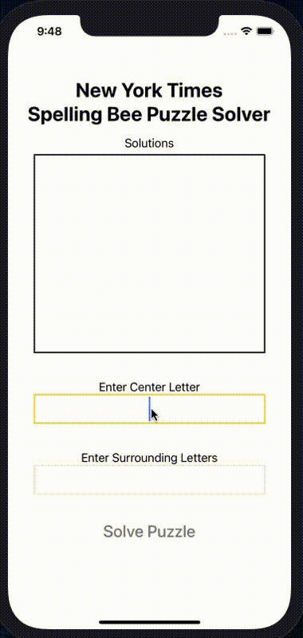

# 🐝  React Native NYT Spelling Bee Solver 🐝

## What is this?
A mobile app to solve the New York Time's daily [Spelling Bee](https://www.nytimes.com/puzzles/spelling-bee) puzzle.

## Demo



## Why?
The purpose of project is so that I can cheat on NYT Spelling Bee and to learn React Native.

## Technologies Used
* React Native
* Expo -- for easier deployment
* Typescript -- (barely)
* Eslint -- for code formatting

## Word Dictionary
The dictionary used is the [TWL06 Scrabble Word List](https://www.wordgamedictionary.com/twl06/). It can be downloaded [here](https://www.wordgamedictionary.com/twl06/download/twl06.txt).

## Dev Setup
```bash
git clone https://github.com/zachbellay/spelling-bee-solver.git
cd spelling-bee-solver
npm install && npm start
```